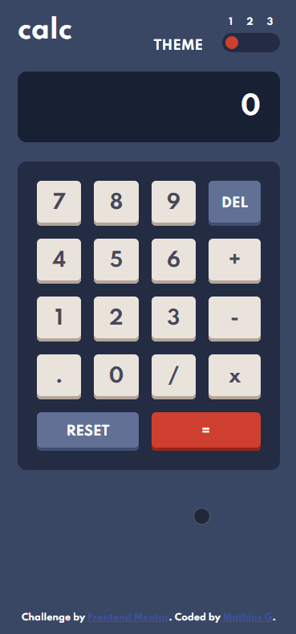
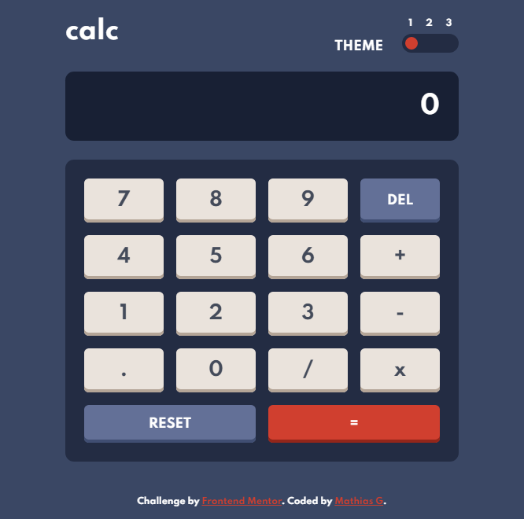
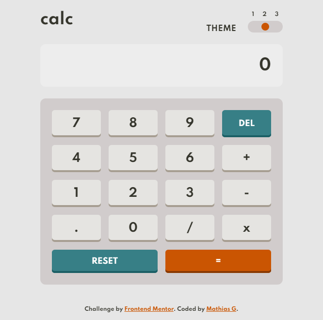
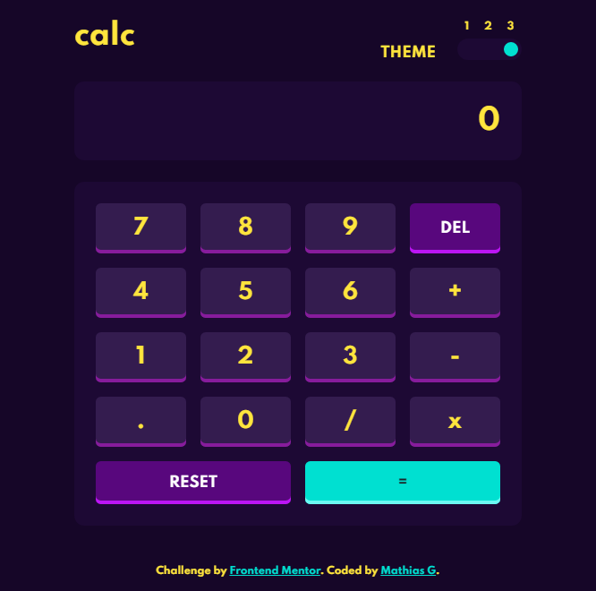
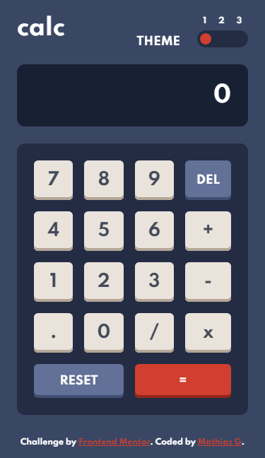
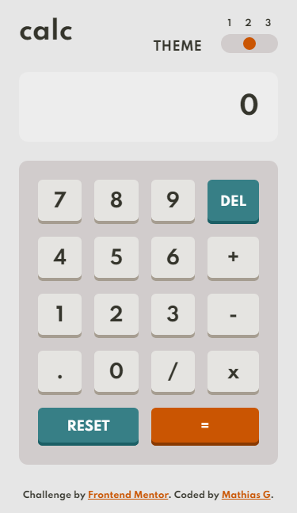
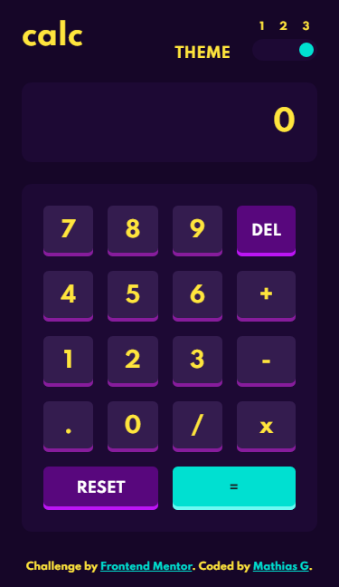

# Frontend Mentor - Calculator app


# Frontend Mentor - Calculator app solution

This is a solution to the [Calculator app challenge on Frontend Mentor](https://www.frontendmentor.io/challenges/calculator-app-9lteq5N29). Frontend Mentor challenges help you improve your coding skills by building realistic projects. 

## Table of contents

- [Overview](#overview)
  - [The challenge](#the-challenge)
  - [Screenshot](#screenshot)
  - [Links](#links)
- [My process](#my-process)
  - [Built with](#built-with)
  - [What I learned](#what-i-learned)
  - [Continued development](#continued-development)
  - [Useful resources](#useful-resources)
- [Author](#author)
- [Acknowledgments](#acknowledgments)

**Note: Delete this note and update the table of contents based on what sections you keep.**

## Overview

### The challenge

Users should be able to:

- See the size of the elements adjust based on their device's screen size
- Perform mathmatical operations like addition, subtraction, multiplication, and division
- Adjust the color theme based on their preference
- **Bonus**: Have their initial theme preference checked using `prefers-color-scheme` and have any additional changes saved in the browser

### Screenshot











### Links

- Solution URL: [github repository](https://github.com/mithivi/Frontendmentor_calc_MathiasGenibrel)
- Live Site URL: [github Pages](https://mithivi.github.io/Frontendmentor_calc_MathiasGenibrel/)

## My process

### Built with

- Semantic HTML5 markup
- CSS custom properties
- Flexbox
- CSS Grid
- JavaScript
- Mobile-first workflow

### What I learned

I learned how to use dynamic properties between javascript and css, with variable modification like:

To see how you can add code snippets, see below:

```js
const displayTheme = (userChoice = 1) => {
  setColor(userChoice);
  const root = document.documentElement;

  root.style.setProperty("--background-color", BACKGROUND_COLOR); //for set new color of my CSS variables
  // next code...
};
```

### Continued development

Improve my skills in javascript, with asynchronous functions and api calls

### Useful resources

- [Book of javascript](https://eloquentjavascript.net) - I learned javascript with this book.

## Author

- Github - [Mathias Genibrel](https://github.com/mithivi)
- Frontend Mentor - [@mithivi](https://www.frontendmentor.io/profile/mithivi)
- linkedin - [Mathias Genibrel](https://www.linkedin.com/in/mathias-genibrel-94a782211/)

## Acknowledgments

For the bonus you can use the localstorage of the browser to be able to store the last theme selected by the user.